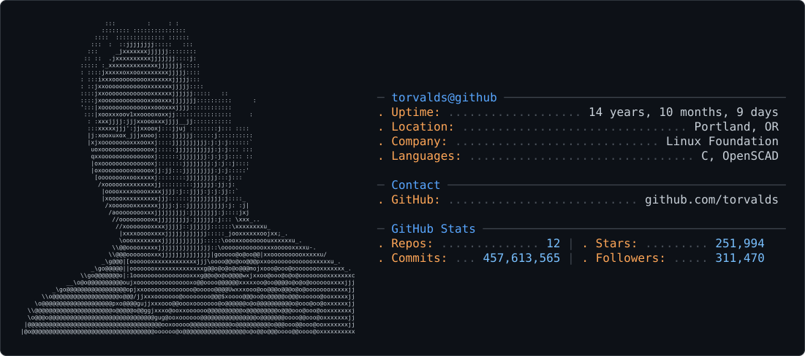

# gh-ascii

Turn any GitHub handle into a neofetch-style ASCII profile card (SVG) for your
profile README — fully automatic. The avatar is converted to ASCII art and the
stats (uptime, languages, repos, stars, commits, contributions, contact info)
are pulled live from the GitHub API.

Inspired by [Andrew6rant's profile README](https://github.com/Andrew6rant/Andrew6rant/tree/main),
but with zero manual setup: just a handle.

<picture>
  <source media="(prefers-color-scheme: dark)" srcset="assets/example-dark.svg" />
  <source media="(prefers-color-scheme: light)" srcset="assets/example-light.svg" />
  
</picture>

<sub>`torvalds`, generated fully automatically — avatar → ASCII, stats via the GitHub API.</sub>

## Usage

No hosting required — the SVGs live in your own repo:

1. Open the generator UI at `/`, type your handle, and download
   `dark_mode.svg` + `light_mode.svg`.
2. Commit both files to your profile repo (`github.com/<you>/<you>`), next to
   the README.
3. Paste this into `README.md`:

```html
<picture>
  <source media="(prefers-color-scheme: dark)" srcset="dark_mode.svg" />
  <source media="(prefers-color-scheme: light)" srcset="light_mode.svg" />
  
</picture>
```

### Agent mode — let your AI do it

Copy this into Claude Code, Cursor, or any coding agent (replace `<handle>`
and `<gh-ascii-url>`; the generator UI produces a pre-filled version):

```text
Add a gh-ascii ASCII profile card to my GitHub profile README.

Context:
- My GitHub handle: <handle>
- My profile README lives in the repo <handle>/<handle>. If it doesn't
  exist, create it as a public repo with a README.
- Card generator: <gh-ascii-url>/<handle>?theme=dark|light returns an SVG.

Steps:
1. Clone github.com/<handle>/<handle> and download both themes into its root:
   curl -fL "<gh-ascii-url>/<handle>?theme=dark" -o dark_mode.svg
   curl -fL "<gh-ascii-url>/<handle>?theme=light" -o light_mode.svg
2. Render or open both SVGs and look at them before committing.
3. Insert this at the top of README.md, keeping all existing content:
   <picture>
     <source media="(prefers-color-scheme: dark)" srcset="dark_mode.svg" />
     <source media="(prefers-color-scheme: light)" srcset="light_mode.svg" />
     's GitHub profile" src="dark_mode.svg" />
   </picture>
   If the light card reads poorly against white, use a plain
    instead of <picture> — the dark
   card carries its own background.
4. Commit both SVGs + the README change ("feat: add gh-ascii profile card")
   and push.
5. Confirm it renders at github.com/<handle>.
```

### Keep it fresh — daily refresh workflow

Committed SVGs are a snapshot: stars, followers and especially Uptime drift out
of date and nothing tells you.
[`.github/workflows/refresh-card.yml.example`](.github/workflows/refresh-card.yml.example)
is a drop-in workflow for your profile repo — daily cron plus a manual **Run
workflow** button, and it commits only when the card actually changed, so it
never spams your history.

Copy it in as `.github/workflows/refresh-card.yml` and replace `<handle>` with
your username:

<details>
<summary><code>refresh-card.yml</code></summary>

```yaml
# gh-ascii — daily card refresh
#
# Copy this file into your profile repo (github.com/<you>/<you>) as
# .github/workflows/refresh-card.yml and replace <handle> with your username.
#
# Committed SVGs are a frozen snapshot: stars, followers and Uptime silently
# go stale. This re-downloads both themes once a day and commits them only when
# the card actually changed, so the numbers stay current without you touching
# anything.
#
# Heads-up: GitHub disables scheduled workflows after 60 days of repository
# inactivity and emails the owner. Profile repos are quiet by design, so this
# can bite — if the card stops updating, re-enable the workflow from the
# Actions tab (the "Run workflow" button is also a quick way to check it).

name: Refresh gh-ascii card

on:
  schedule:
    # Daily at 06:17 UTC. Off-the-hour times get scheduled more reliably —
    # GitHub drops runs when everyone piles onto :00.
    - cron: "17 6 * * *"
  workflow_dispatch:

permissions:
  contents: write

concurrency:
  group: refresh-gh-ascii-card
  cancel-in-progress: true

jobs:
  refresh:
    runs-on: ubuntu-latest
    steps:
      - uses: actions/checkout@v7

      - name: Download both themes
        env:
          HANDLE: <handle>
          # Swap this for your own deployment if you self-host gh-ascii.
          GH_ASCII_URL: https://gh.crafter.run
          # Optional: ASCII resolution, 40-160 (default 100).
          # COLS: "120"
        run: |
          curl -fsSL --retry 3 --retry-delay 5 \
            "$GH_ASCII_URL/$HANDLE?theme=dark${COLS:+&cols=$COLS}" \
            -o dark_mode.svg
          curl -fsSL --retry 3 --retry-delay 5 \
            "$GH_ASCII_URL/$HANDLE?theme=light${COLS:+&cols=$COLS}" \
            -o light_mode.svg

      - name: Commit only if the card changed
        run: |
          git config user.name "github-actions[bot]"
          git config user.email "41898282+github-actions[bot]@users.noreply.github.com"
          git add dark_mode.svg light_mode.svg
          if git diff --cached --quiet; then
            echo "Card unchanged — nothing to commit."
          else
            git commit -m "chore: refresh gh-ascii card"
            git push
          fi
```

</details>

One caveat worth knowing: GitHub disables scheduled workflows in repos with no
pushes for 60 days. Profile repos are quiet by design, so if the card ever
stops updating, re-enable the workflow from the Actions tab.

API (used by the UI, or embed directly if you host a deployment):

- `GET /<handle>` — returns the SVG card (`?theme=dark` default, `?theme=light`)
- `?cols=40..160` — ASCII resolution (default 100); higher = more detail, bigger card
- `?image=<url>` — custom image URL for the ASCII portrait (replaces default GitHub avatar)
- `?bg=keep` or `?cutout=false` — preserve original image background (disables ML portrait cutout)
- `POST /<handle>` — multipart form upload (`image` file, `theme`, `cols`, `bg`) to render an SVG from a local file

## How the ASCII rendering works

Techniques borrowed from the best open-source converters (chafa, AAlib,
Acerola's ASCII shader, jp2a):

- **ML background removal** (ONNX portrait matting) isolates the subject.
- **Measured glyph metrics** — `scripts/calibrate-glyphs.html` renders every
  printable ASCII glyph in the card's actual font stack and measures its real
  ink coverage per cell quadrant (baked into `lib/glyphs.ts`). In Menlo, `N`
  is denser than `@` — hand-written ramps get this wrong.
- **AAlib-style structure matching** — each cell is sampled as 2x2 quadrants
  and matched against glyph quadrant coverage, so corners, stems and
  diagonals pick shape-appropriate glyphs.
- **Chafa-style fill/structure split** — flat cells walk a stable measured
  density ramp instead, so smooth areas don't turn into letter salad.
- **Acerola-style edge voting** — Sobel directions per subcell; a `/ \ | -`
  contour glyph overrides only when 3 of 4 subcells agree on direction.
- Adaptive unsharp, percentile normalization, damped Floyd–Steinberg on the
  density residual, and bimodal (line-art) detection round out the pipeline.

## Development

```bash
bun install
bun run dev
```

### `GITHUB_TOKEN`

Set it. It is nominally optional, but it decides how much of the card exists:

| | without a token | with a token |
| --- | --- | --- |
| Rate limit | 60 requests/hour, per deployment IP | 5,000/hour |
| Repos scanned for stars | 300 | 1,500 |
| Languages | top 5 by repo count | share of code by bytes (`C 98%, Assembly 1%`) |
| Commits, PRs, issues, reviews, contributed-to | — | shown |
| Forks, top repo | — | shown |
| Contribution graph | — | shown |

Everything in the right-hand column comes from the GraphQL API, which has no
anonymous tier, so those rows are simply omitted when no token is set. They are
also omitted for organization handles, which GraphQL has no `user` for — orgs
still render the REST half of the card.

Commit counts deliberately do **not** come from the commit-search API: it
counts every fork's copy of a commit, which rendered `torvalds` at 410 million
commits. They are summed from `contributionsCollection` instead, one query per
year of the account's life, which is the number GitHub's own profile shows.

Responses are cached for an hour (`Cache-Control` + fetch revalidation), so
cards stay fresh without hammering the API.

## Credits

This project is inspired by
[**Andrew6rant/Andrew6rant**](https://github.com/Andrew6rant/Andrew6rant/tree/main) —
Andrew Grant's hand-crafted neofetch-style profile README (self-updating ASCII
portrait + live stats SVG) that set the visual bar. gh-ascii automates that
idea for any GitHub handle.

Rendering techniques were adapted from the open-source ASCII ecosystem:
[chafa](https://github.com/hpjansson/chafa) (fill/structure symbol split),
[AAlib](https://aa-project.sourceforge.net/aalib/) (subcell brightness matching),
[Acerola's ASCII shader](https://github.com/GarrettGunnell/AcerolaFX) (edge
direction voting), and [jp2a](https://github.com/Talinx/jp2a) (directional
edge glyphs).
